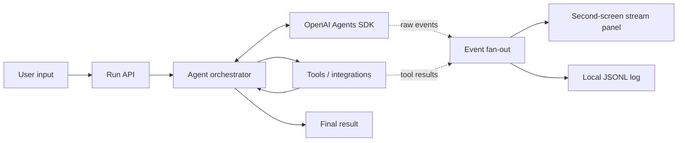
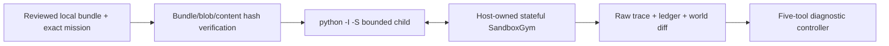
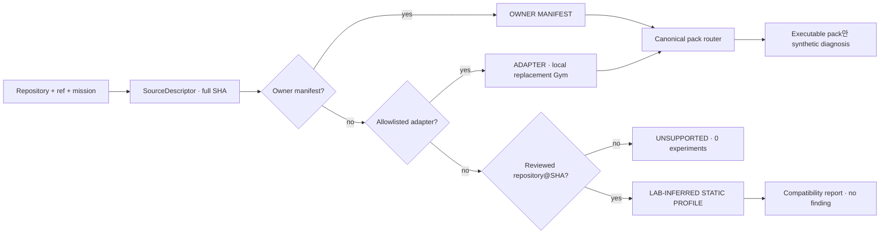

# Architecture

## Goal

한 번의 입력이 자율 실행, 도구 호출, 검증, 최종 산출물까지 이어지고 동일 실행의 원시 이벤트가 별도 화면에 실시간 노출되어야 합니다.

## External target intake

외부 GitHub target은 실행 전에 full SHA로 고정한다. allowlisted owner manifest와 선언된
entrypoint를 bounded evidence로 읽으면 기존 deterministic Gym 경로를 사용한다. manifest가
없더라도 exact SHA가 검토된 adapter와 일치하면 AST 계약을 확인한 뒤 network-disabled local
replacement Gym으로 실행한다. 그 밖에는 exact SHA static profile이 있는 경우에만
metadata-only compatibility를 반환한다. 이 외부 GitHub 경로들은 submitted source code를
import하거나 실행하지 않는다.

유일한 source-code 실행 경로는 저장소에 체크인되고 bytes·manifest·mission이 모두 고정된
`examples/demo-agent-repo`다. launcher가 해당 exact bundle용 `LocalSandboxRunner`를 명시적으로
주입한 경우에만 `python -I -S` child가 entrypoint를 실행한다. 도구 호출은 network-disabled
host-owned SandboxGym으로만 전달되고, 임의 경로·임의 GitHub source·dependency install은
허용하지 않는다. child 또는 controller가 typed failure로 멈추면 finding으로 바꾸거나 다른
fixture로 fallback하지 않는다.

Static profile은 최대 4개 allowlisted path의 Git blob metadata만 검증한다. source code,
prompt, 개인정보, raw crawl을 event/artifact에 복제하지 않고 symlink·secret-like path·
oversized file·blob drift를 거부한다. 세부 계약은
[`participant-repository-intake.md`](participant-repository-intake.md)다.

## Decisions to make at kickoff

1. Target user and one painful workflow
2. One-sentence success metric
3. Required tools versus impressive-but-optional tools
4. Manager-style orchestration versus handoffs
5. Tool timeout, retry, and fallback policy
6. Surprise Task input boundary
7. What the 3-minute demo can prove reliably

## Non-goals for the first thin slice

- User accounts
- Complex persistence
- Multiple UI frameworks
- Premature multi-agent decomposition
- Integrations that cannot be demonstrated offline or with a fallback
