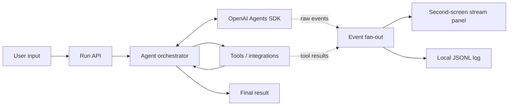

# Architecture

## Goal

한 번의 입력이 자율 실행, 도구 호출, 검증, 최종 산출물까지 이어지고 동일 실행의 원시 이벤트가 별도 화면에 실시간 노출되어야 합니다.

## Decisions to make at kickoff

1. Target user and one painful workflow
2. One-sentence success metric
3. Required tools versus impressive-but-optional tools
4. Manager-style orchestration versus handoffs
5. Tool timeout, retry, and fallback policy
6. Surprise Task input boundary
7. What the 3-minute demo can prove reliably

## Non-goals for the first thin slice

- User accounts
- Complex persistence
- Multiple UI frameworks
- Premature multi-agent decomposition
- Integrations that cannot be demonstrated offline or with a fallback

