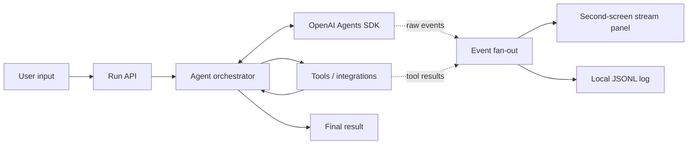
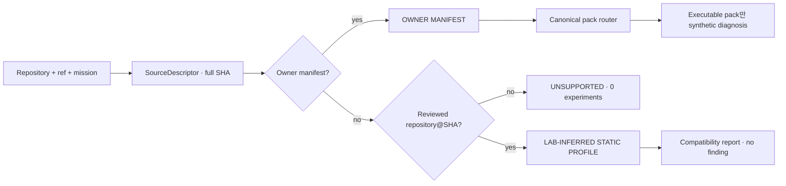

# Architecture

## Goal

한 번의 입력이 자율 실행, 도구 호출, 검증, 최종 산출물까지 이어지고 동일 실행의 원시 이벤트가 별도 화면에 실시간 노출되어야 합니다.

## External target intake

외부 GitHub target은 실행 전에 full SHA로 고정한다. allowlisted owner manifest가 있으면
기존 deterministic Gym 경로를 사용하고, manifest가 없으면 exact SHA에 검토된 static
profile이 있는 경우에만 metadata-only compatibility를 반환한다.

Static profile은 최대 4개 allowlisted path의 Git blob metadata만 검증한다. source code,
prompt, 개인정보, raw crawl을 event/artifact에 복제하지 않고 symlink·secret-like path·
oversized file·blob drift를 거부한다. 세부 계약은
[`participant-repository-intake.md`](participant-repository-intake.md)다.

## Decisions to make at kickoff

1. Target user and one painful workflow
2. One-sentence success metric
3. Required tools versus impressive-but-optional tools
4. Manager-style orchestration versus handoffs
5. Tool timeout, retry, and fallback policy
6. Surprise Task input boundary
7. What the 3-minute demo can prove reliably

## Non-goals for the first thin slice

- User accounts
- Complex persistence
- Multiple UI frameworks
- Premature multi-agent decomposition
- Integrations that cannot be demonstrated offline or with a fallback
